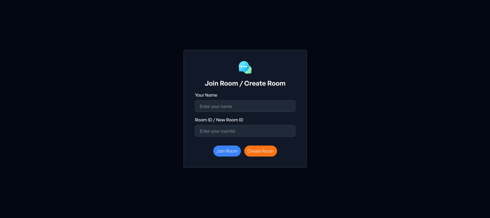
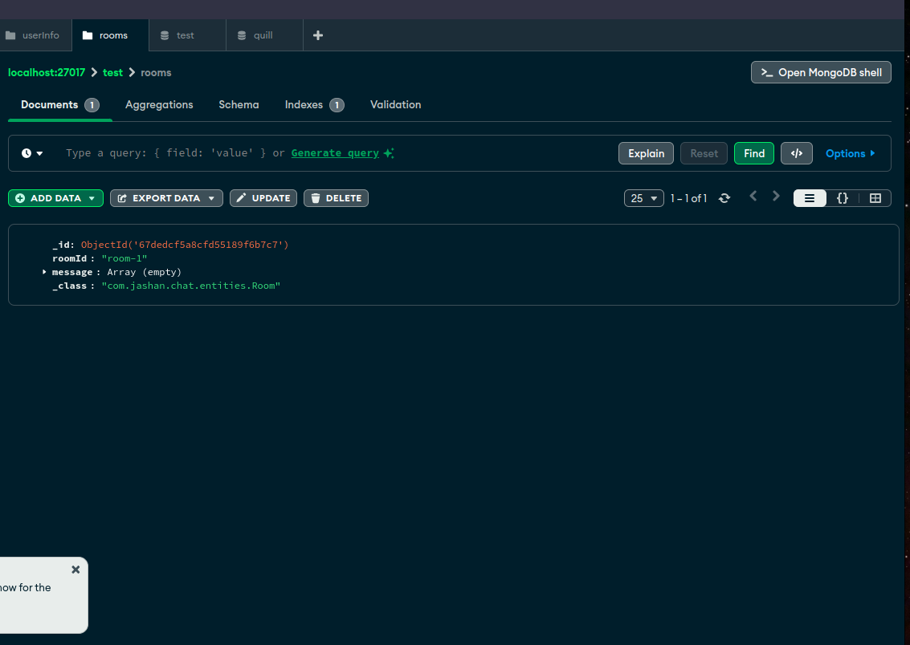

# Chat Application

This is a real-time chat application built using **Spring Boot** and **React**, leveraging **WebSockets** for live messaging.

## Features
- Create and join chat rooms
- Real-time messaging
- MongoDB for message storage
- Multi-client support

## Screenshots

### . Create a room
Click on the create room button


### 2. Room Created
A chat room is created successfully and saved in database i.e MongoDb.



### 3. Second Client Joins the Room
Another user joins the created chat room.


### 4. Real-time Chatting
Users can send and receive messages in real-time.


## Technologies Used
- **Backend:** Spring Boot, WebSockets, MongoDB
- **Frontend:** React, Tailwind CSS

## How to Run

### Backend
```sh
cd backend
./mvnw spring-boot:run
```

### Frontend
```sh
cd frontend
npm install
npm start
```

## Contribution
Feel free to fork this repository and create a pull request with improvements!
